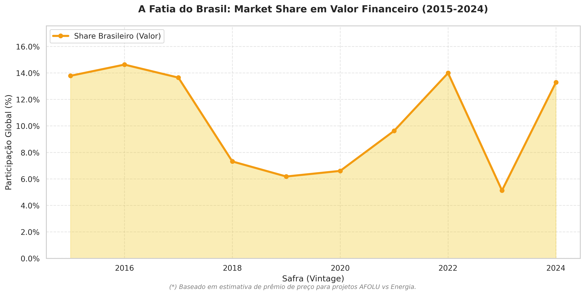
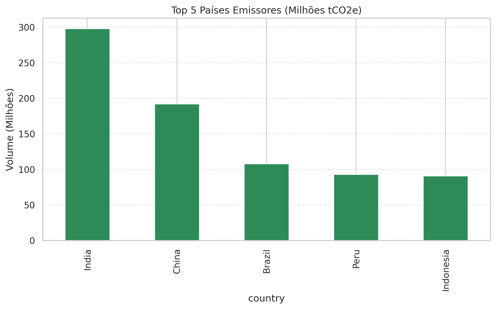
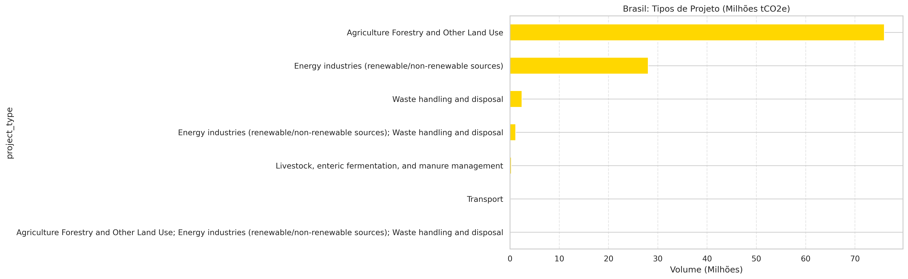
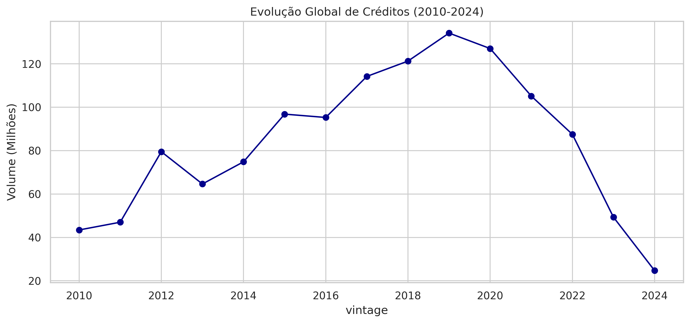
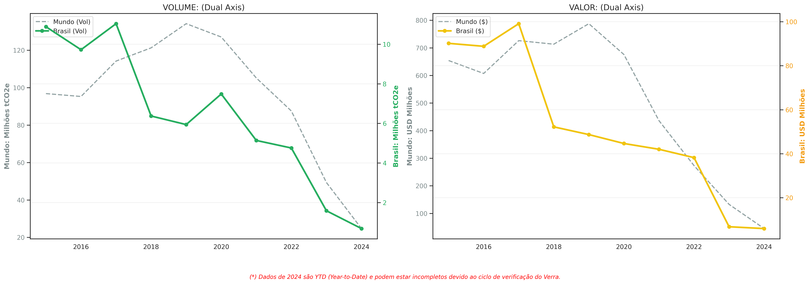
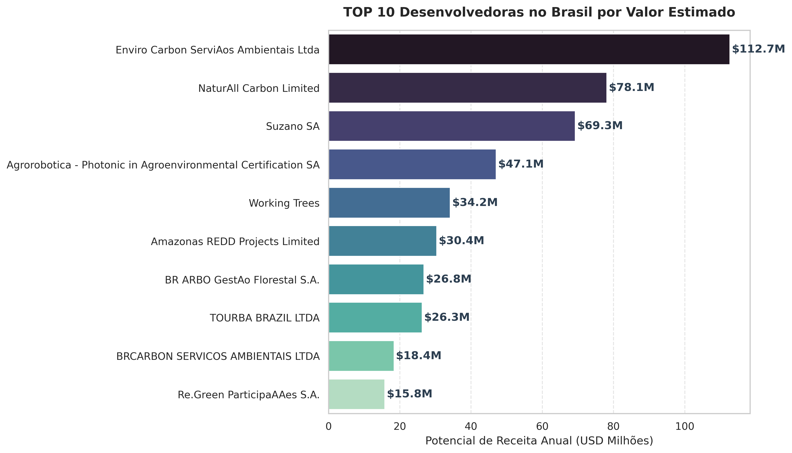

# 🇧🇷 Auditoria do Mercado de Carbono (Verra): A Estratégia de Valor do Brasil


> **Resumo Executivo:** Enquanto os mercados asiáticos dominam o *volume* de créditos de carbono (commodities), o Brasil lidera em *valor financeiro* devido aos altos prêmios de projetos baseados na natureza (NBS).

---

## 📊 O Insight Principal
Esta análise audita os dados do registro Verra (VCS) entre 2015-2025 para revelar uma dinâmica clara que **Volume não é igual a Valor.**



### Principais Descobertas
* **A Ilusão do Volume:** Competidores globais (Índia/China) focam em créditos de energia renovável, negociados a margens baixas (~$1.50/tCO2e).
* **O Diferencial Brasileiro:** O Brasil captura uma fatia desproporcional do valor financeiro global devido a projetos de Manejo Florestal (AFOLU) com preços premium (~$10.00/tCO2e).
* **Liderança de Mercado:** Empresas como Biofílica Ambipar e Carbonext consolidam-se como líderes em geração de receita no cenário doméstico.

---

## 📈 Análise Estendida (Galeria de Insights)

Abaixo, os 6 eixos principais da auditoria detalhando a transição de volume para valor:

| 1. Top 5 Emissores Globais | 2. Mix de Projetos (Brasil) |
| :---: | :---: |
|  |  |
| *Cenário dominado por volume asiático.* | *Predomínio de Nature-Based Solutions.* |

| 3. Evolução Temporal (Volume) | 4. Contraste: Volume vs Valor |
| :---: | :---: |
|  |  |
| *Crescimento histórico das emissões.* | *Brasil x média global.* |

| 5. Market Share Financeiro | 6. Líderes do Mercado (Developers) |
| :---: | :---: |
|  |  |
| *Faturamento do Brasil.* | *Ranking das principais desenvolvedoras.* |

---

## 🛠️ Estratégia Técnica
O projeto foi estruturado como um pipeline de dados:

1.  **Ingestão:** Tratamento de grandes volumes de dados CSV com codificação `latin1`.
2.  **Limpeza:** Normalização de texto via `Unicodedata` para correção de caracteres especiais.
3.  **Modelagem:** Criação de um `Pricing Engine` customizado para simular valuations de mercado.
4.  **Visualização:** Gráficos utilizando `Seaborn` e `Matplotlib` com eixos duplos e formatação percentual.

## 📂 Estrutura do Projeto
```bash
├── data/                  # Dados brutos (protegidos por .gitignore)
├── output/                # Gráficos exportados em alta resolução
├── vcs_analysis.ipynb     # Notebook principal com a lógica da auditoria
├── vcs_analysis.html      # Relatório para visualização rápida
└── README.md              # Documentação do projeto


