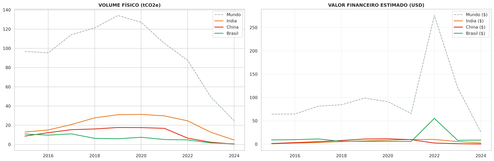
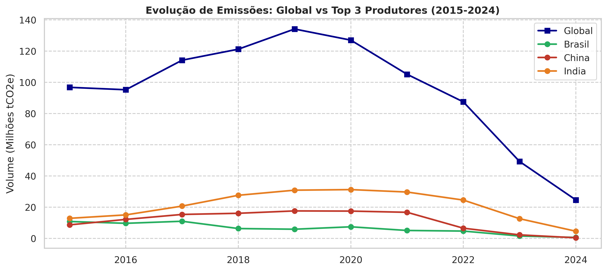
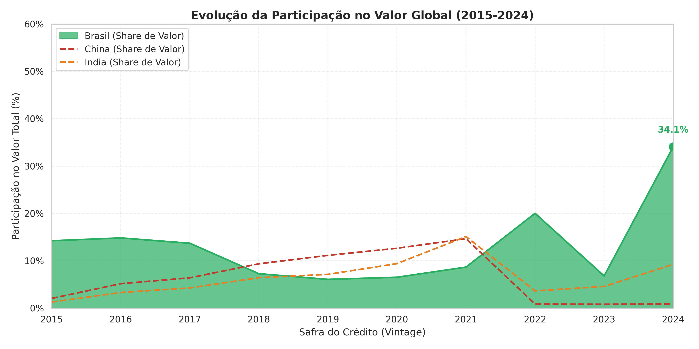

=======
# Verra VCS Market Analysis  
### An Empirical Analysis of the Voluntary Carbon Market Using Issuance and Pipeline Data

---

## Overview

This repository presents a **data-driven empirical analysis of the Voluntary Carbon Market (VCM)** using **real registry data from Verra’s Verified Carbon Standard (VCS)**.  
The study integrates **historical credit issuance data** with **pipeline project information** to examine market structure, issuance dynamics, and aggregated price behavior in a heterogeneous and institutionally evolving market.

The analysis is descriptive and exploratory in nature, prioritizing **methodological transparency**, **reproducibility**, and **explicit recognition of market limitations**, rather than normative valuation or forecasting.

---

## Key empirical insights

### 1. Volume does not imply value

High issuance volumes do not necessarily translate into higher economic value.  
This figure illustrates how **Nature-Based Solutions (AFOLU)** concentrate a disproportionate share of market value relative to their physical volume, reflecting the non-fungibility of credits and differentiated buyer preferences within the VCM.

---

### 2. Prices are structurally volatile and context-dependent

Aggregated price indicators exhibit significant temporal variation, including periods of heightened volatility.  
These dynamics reflect not only supply and demand conditions, but also **reputational shocks**, **changes in corporate climate strategies**, and **expectations regarding future regulatory alignment**, reinforcing the limits of interpreting prices as signals of fundamental value.

---

### 3. Market structure is evolving over time

Market share dynamics indicate that the **composition of the Voluntary Carbon Market is not static**, with shifts across regions and project categories over time.  
This highlights the relevance of combining historical issuance data with pipeline information to contextualize future supply patterns.

---

## Data Sources

All analyses are based on **publicly available registry data from Verra**:

- **VCS Issuance** – verified credits already issued, including project attributes, volumes, vintages, and classifications  
- **VCS Pipeline** – registered and pipeline projects, offering a forward-looking view of potential future supply  

Raw data are processed locally and are not redistributed in this repository.

---

## Methodological Notes

The notebook implements a **fully reproducible analytical workflow**, including:

- Data ingestion and standardization  
- Text normalization and consistency checks  
- Feature construction and categorical classification  
- Aggregated statistical analysis and visualization  

Price-related metrics are treated as **descriptive indicators**, not as estimates of intrinsic value or social cost.

---

## How to explore this repository

-  **Quick understanding:** read this README and inspect the figures  
-  **Full analysis:** open `verra_vcs_voluntary_carbon_market_analysis.ipynb`  
-  **Rendered version:** open the corresponding HTML file

---

## Disclaimer

This project is intended solely for research and analytical purposes.  
It does not constitute financial advice, market auditing, or validation of any carbon credit, project, or registry.
>>>>>>> 83f627e (Replace legacy project structure with updated VCS market analysis)
